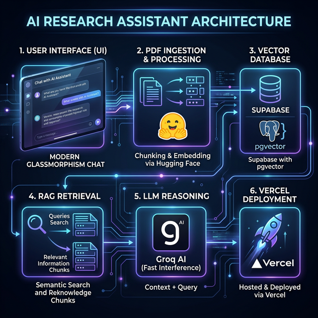

# 📚 Research AI — Intelligent Research Assistant

> **Chat with your research papers.** Upload academic PDFs, index them into a high-performance vector database, and use state-of-the-art AI to extract insights, summarize findings, and analyze methodologies.

[](https://researchbot-nu.vercel.app/chat)
[](https://laravel.com)
[](https://groq.com)

---

## 🔗 Live Demo & Links
- **Deployed Site**: [researchbot-nu.vercel.app/chat](https://researchbot-nu.vercel.app/chat)
- **Video Walkthrough**: [Watch the Screen Recording](https://pub-6d76cdb126d046789be118b4a27dce70.r2.dev/Screen%20Recording%202026-03-09%20131401.mp4)

---

## 🏗️ System Architecture



The project implements a full **RAG (Retrieval-Augmented Generation)** pipeline:
1.  **Ingestion**: PDFs are parsed, sanitized for UTF-8 compatibility, and split into 1000-character chunks.
2.  **Embeddings**: Each chunk is transformed into a 384-dimensional vector using Hugging Face's `BAAI/bge-small-en-v1.5` model.
3.  **Vector DB**: Vectors are stored in **Supabase (PostgreSQL)** using the `pgvector` extension for efficient cosine similarity search.
4.  **Retrieval**: Questions are embedded and matched against the database to retrieve the top 5 most relevant excerpts.
5.  **Generation**: **Groq AI (Llama 3.1)** processes the context and generates a grounded, sourced response.

---

## 🛠️ Technology Stack

-   **Backend**: Laravel 12 (PHP 8.3)
-   **Database**: Supabase / PostgreSQL + `pgvector`
-   **AI Inference**: 
    -   **Groq AI**: Fast LLM processing (`llama-3.1-8b-instant`)
    -   **Hugging Face**: Text embeddings (`bge-small-en-v1.5`)
-   **Frontend**: Tailwind CSS + Blade + Vanilla JS (AJAX Chat Interface)
-   **Deploy**: Vercel (Serverless PHP)

---

## ✨ Features

-   **Premium Glassmorphism UI**: A modern, dark-mode interface with smooth animations and responsive design.
-   **Intelligent Chat**: Get answers based *only* on the content of your research papers.
-   **Source Citations**: Every AI response includes direct references to specific excerpts from the papers.
-   **Fast Indexing**: Real-time progress logging for PDF processing and vector storage.
-   **Suggestion Chips**: Quick-start prompts for Summaries, Methodology, Results, and References.

### Screenshots

| **Dashboard & Chat** | **Upload & Indexing** |
|:---:|:---:|
|  |  |
| **Vector DB (Supabase)** | **LLM Usage (Groq)** |
|  |  |

---

## 🚀 Deployment on Vercel

This project is optimized for Vercel deployment using the `vercel-php@0.7.2` runtime.

1.  **Read-Only Fix**: The app is configured to use `/tmp` for compiled views and cache storage.
2.  **Environment Variables**:
    -   `APP_KEY`: Your Laravel application key.
    -   `DB_HOST`, `DB_PORT`, `DB_DATABASE`, `DB_USERNAME`, `DB_PASSWORD`: Your Supabase PostgreSQL credentials.
    -   `GROQ_API_KEY`: API key from Groq Cloud.
    -   `HUGGINGFACE_API_KEY`: API token from Hugging Face.

---

## 💻 Local Setup

1.  **Clone the Repo**:
    ```bash
    git clone https://github.com/Dewick75/research-chat-bot.git
    cd research-chat-bot
    ```
2.  **Install Dependencies**:
    ```bash
    composer install
    npm install && npm run build
    ```
3.  **Configure Environment**: 
    - Copy `.env.example` to `.env`
    - Update your API keys and DB credentials.
4.  **Run Migrations**:
    ```bash
    php artisan migrate
    ```
5.  **Start the Server**:
    ```bash
    php artisan serve
    ```

---

Developed with ❤️ using Laravel & AI.
